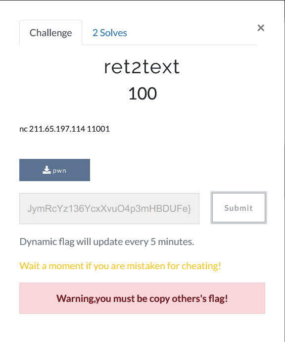

# Online Challenges Plugin for CTFd

> It's a plugin  that uses to generate dynamic flag for `Web` or `Pwn` online envirenment Chanls with dockerfile

## Usage

1. New a Online Challenges with a random token.
2. Copy the token into [send.py](demo/send.py) and change the platfrom url.
3. Config the interval(default is 5 seconds) in [send.py](demo/send.py).
4. Copy the `send.py` into your Online envirenment and run it.

* Dockerfile [demo](demo/)

## Install

**Requires**: [CTFd >= 1.1.2](https://github.com/CTFd/CTFd/releases/tag/1.1.2)
> Don't test on earlier version 

* Clone this repository to `CTFd/plugins`

**Notes**: make sure this folder is named `OnlineChallenge` so that `CTFd` can load the assets.

## TODO

- Server
    - [x] Optimize Web UI
    - [x] Cheat warnings when find someone copy others' flag
    - [ ] Create and Update the token easier
    - [ ] More detailed log 
    - [ ] Secure authentication with token
    - [x] Cheat Monitor
- Client
    - [ ] Regenerate the flag when it accessed
    - [x] More detailed log
- [x] Useage demo

## Screenshot

**Challenges**

**Admin Monitor**

## [CHANGELOG](CHANGELOG.md)

## Reference

* https://github.com/CTFd/CTFd/wiki/Plugins
* https://mozilla.github.io/nunjucks/cn/templating.html#part-9d9c663eba1f6097

